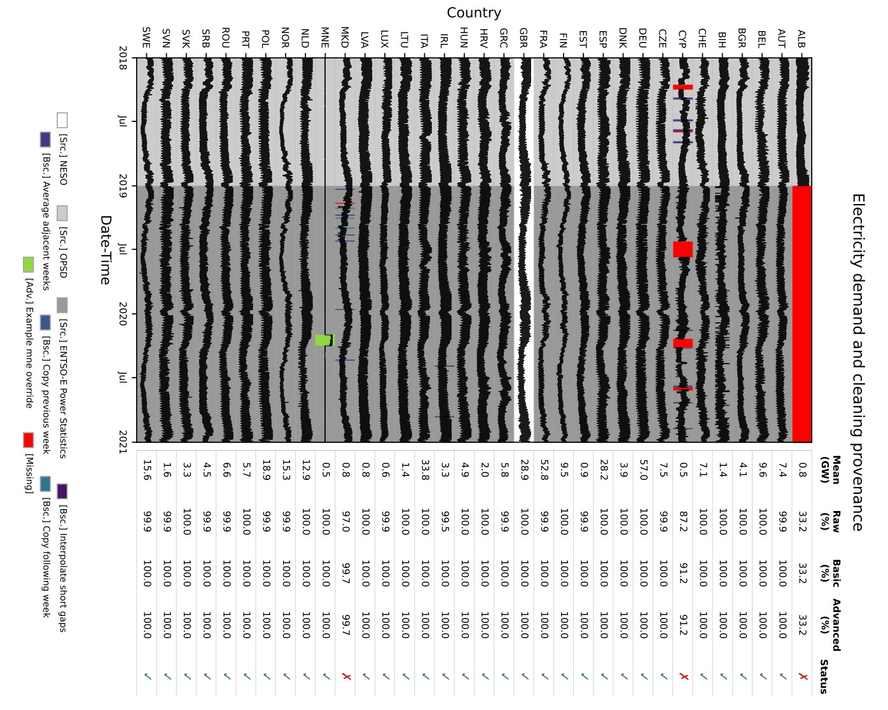

# European electricity demand

This Modelblocks module prepares regular electricity-demand time series for European target regions. National demand observations from multiple providers are combined and cleaned on a user-defined time grid, then spatially disaggregated using population data and aggregated to user-provided shapes.

Demand cleaning is performed with tlean, while this module remains responsible for electricity-demand providers, Modelblocks configuration, auxiliary-data acquisition, workflow orchestration, spatial disaggregation, and diagnostic outputs.

<p align="center">
  
</p>
<p align="center">
  <em>Example diagnostic showing electricity-demand provenance, basic, and advanced gap filling.</em>
</p>

## About
<!-- Please do not modify this templated section -->

This is a modular `snakemake` workflow created as part of the [Modelblocks project](https://www.modelblocks.org/). It can be imported directly into any `snakemake` workflow.

For more information, please consult the Modelblocks [documentation](https://modelblocks.readthedocs.io/en/latest/),
the [integration example](./tests/integration/Snakefile),
and the `snakemake` [documentation](https://snakemake.readthedocs.io/en/stable/snakefiles/modularization.html).

## Overview

The workflow first prepares a cleaned national electricity-demand time series on the configured time grid and then spatially distributes that demand to the requested target regions.

The main processing stages are:

1. Download demand data from the configured providers.
2. Prepare each provider dataset on the configured time grid.
3. Combine available providers according to the configured source-priority order.
4. Apply deterministic basic cleaning rules.
5. In `advanced` mode, determine which configured advanced rules are active for the current countries and time grid, acquire any required auxiliary demand data, construct or read advanced profiles, and apply them.
6. Finalise national demand together with cleaning provenance.
7. Download and prepare gridded population data.
8. Spatially disaggregate national demand using population weights and aggregate it to the user-provided target shapes.

A simplified representation is:

```text
Demand providers
      │
      ▼
Prepare and combine
      │
      ▼
Basic cleaning
      │
      ├── off/basic ────────────────────────────┐
      │                                          │
      └── advanced ─► plan auxiliary data        │
                       │                         │
                       ▼                         │
                 acquire / prepare               │
                       │                         │
                       ▼                         │
                  advanced rules ────────────────┤
                                                 ▼
                                      Final national demand
                                          + provenance
                                                 │
                                                 ▼
                                      Population-weighted
                                     spatial disaggregation
                                                 │
                                                 ▼
                                        Regional demand
```

## Configuration

The module is configured through `config/config.yaml`.

The key configuration groups are:

- `temporal_scope`: grid start, grid end, and fixed frequency;
- `load_sources`: demand-provider priority;
- `gap_filling`: cleaning mode plus basic and advanced rules.

See the [configuration README](./config/README.md), the [example configuration](./config/config.yaml), and the authoritative [configuration schema](./workflow/internal/config.schema.yaml).

## Time grid

All national demand cleaning is performed on an explicit regular time grid defined by:

```yaml
temporal_scope:
  start: "2017-01-01"
  end: "2017-01-03"
  frequency: "1h"
```

`start` is inclusive and `end` is exclusive. The difference between `start` and `end` must be an integer multiple of `frequency`.

The configured start timestamp also defines the phase of the grid. Provider and auxiliary timestamps used by the workflow must align with that phase.

## Demand sources

`load_sources` defines both the providers to use and their priority order:

```yaml
load_sources:
  - entsoe
  - neso
  - entsoe_power_statistics
  - opsd
```

Where multiple providers supply a value for the same country and timestamp, the earlier provider in this list has priority.

Available provider identifiers are:

- `entsoe`: ENTSO-E Transparency Platform API. A valid ENTSO-E API token is required when this source is configured;
- `entsoe_power_statistics`: official ENTSO-E Power Statistics historical archive, currently integrated for 2019–2025. No API token is required;
- `neso`: National Energy System Operator historic demand, restricted to Great Britain (`GBR`);
- `opsd`: Open Power System Data, with the currently integrated historical coverage ending at 2019-03-01.

Source identifiers, human-readable names, declared temporal bounds, and context restrictions are defined centrally in [`workflow/internal/source_registry.yaml`](./workflow/internal/source_registry.yaml). Missing temporal bounds or context restrictions in the registry mean that the module declares no corresponding restriction.

## Cleaning and gap handling

Three modes are available:

- `"off"`: do not fill gaps. Quotation marks are required because YAML may interpret an unquoted `off` as the boolean value `false`;
- `basic`: apply configured deterministic rules;
- `advanced`: run basic cleaning first, then execute active advanced rules.

Basic rules are applied sequentially in configuration order. Supported basic methods include `linear_interpolation`, `average_periods`, and `copy_periods`.

Advanced configuration separates reusable **sources** from target **rules**. A source describes how an advanced profile is obtained, for example by constructing it from one or more country-period source profiles or reading an external CSV. A rule states where that source should be applied.

An advanced rule is active when both its target country and target period are relevant to the current model run. Rules outside the requested countries or `temporal_scope` remain valid configuration but do not trigger unnecessary auxiliary-data acquisition.

Advanced rule scopes are:

- `fill_gaps`: use the advanced profile only where target values are missing;
- `overwrite`: replace target values throughout the configured rule period.

Configured periods use half-open intervals, `[start, end)`.

See [Configuration: Advanced gap filling](./config/README.md#advanced-gap-filling) for full examples.

## Provenance and diagnostics

The workflow retains cleaning provenance alongside national demand so observed values can be distinguished from values introduced by basic or advanced rules.

Important diagnostic outputs include:

- **Gap report**: in `advanced` mode, provides a complete record of the contiguous gaps that remain after basic cleaning, including the affected country, start and end timestamps, gap duration, and whether the gap reaches a boundary of the requested time series. This report can be used to identify which periods still require attention and to inform the design of targeted advanced rules;
- **Cleaning method**: the source or rule responsible for each output value;
- **Cleaning-method rank**: numeric ordering used to represent cleaning provenance consistently;
- **Cleaning timeline and summary**: visual and tabular diagnostics showing demand provenance and completeness through the raw, basic, and advanced cleaning stages.

Together, these diagnostics are intended to make gap handling explicit rather than conceal unresolved data behind automatic imputation. A typical advanced workflow is therefore to run the basic cleaning stage, inspect the gap report to identify any remaining missing periods, and then configure advanced rules for gaps that require explicit reconstruction or replacement.

## Input / output structure

The module requires user-provided target shapes. A valid ENTSO-E API token is additionally required when `entsoe` is configured.

Advanced `external_profile` sources may reference user-provided CSV files.

Intermediate provider data, cleaned national demand, provenance, execution plans, and auxiliary data are stored below the module resources path. Final regional electricity demand is written to the configured module results path.

Please consult [`INTERFACE.yaml`](./INTERFACE.yaml) for the module's formal input/output interface.


## Development
<!-- Please do not modify this templated section -->

We use [`pixi`](https://pixi.sh/) as our package manager for development.
Once installed, run the following to clone this repository and install all dependencies.

```shell
git clone git@github.com:modelblocks-org/module_demand_electricity.git
cd module_demand_electricity
pixi install --all
```

Please be aware that this is a multi-environment project (see [pixi.toml](./pixi.toml) for details).
- `default`: used for development and integration testing.
Because it contains `Snakemake`, `conda` and `pytest` as dependencies it **should not be used** in `Snakemake` rules.
- `test`: used for unit testing. It combines the `module` environment with test-only dependencies such as `pytest`.
- `module`: contains minimal dependencies used in `Snakemake` rules.
If modified, be sure to export it to `Snakemake` so it can be recreated by module users:

```shell
# create module.yaml and conda-spec pin files in workflow/envs/
pixi run export-snakemake-env module
```


## Testing
<!-- Please do not modify this templated section -->

For testing, simply run:

```shell
pixi run test-unit
pixi run test-integration
```

To test a minimal example of a workflow using this module:

```shell
pixi shell    # activate this project's environment
cd tests/integration/  # navigate to the integration example
snakemake  # run the workflow!
```

The integration workflow's default Snakemake profile enables Conda, uses 2 cores, and limits concurrent ENTSO-E downloads (including Transparency Platform and Power Statistics acquisition) and NESO downloads to 2 each. These execution settings can be overridden with the corresponding Snakemake command-line options:

- **Cores**: Defaults can be overridden using the `--cores` flag.
- **ENTSO-E downloads**: Override with `--resources entsoe_download=<n>`.
- **NESO downloads**: Override with `--resources neso_download=<n>`.

A complete example:

```shell
snakemake --cores 4 --resources entsoe_download=1 neso_download=1
```

## Adding a demand source

Demand-provider metadata is registered centrally in [`workflow/internal/source_registry.yaml`](./workflow/internal/source_registry.yaml), while provider-specific workflow behaviour lives in a matching `workflow/rules/source_<source>.smk` file.

A new provider normally requires:

1. Add the source identifier and metadata to `workflow/internal/source_registry.yaml`. `display_name` gives the human-readable label; optional `temporal_scope` uses the module-wide half-open convention `[start, end)`; optional `contexts` restricts the source to listed country contexts.
2. Add `workflow/rules/source_<source>.smk` containing the provider-specific acquisition, main preparation, and auxiliary preparation rules and helpers that are required.
3. Add the provider implementation under `workflow/scripts/sources/<source>/` together with any thin Snakemake wrapper scripts needed by the rules.
4. Include the new source rule file directly from `workflow/Snakefile`.
5. Add credentials or other user-facing inputs to `INTERFACE.yaml` only when the provider requires them.
6. Add tests covering the provider and, where applicable, both main-period and advanced auxiliary acquisition.

Prepared national-demand outputs follow the `load_<source>.parquet` naming convention. Generic source validation, display names, and tlean source capabilities are derived from the registry where applicable, so adding a provider should not require separate source-name mappings in those parts of the workflow.

Provider-specific behaviour should remain explicit rather than being encoded as generic registry metadata: APIs, raw cache layouts, download resources, preparation logic, and auxiliary-file resolution belong in the provider implementation and its source rule file.

## References
<!-- Please provide thorough referencing below -->

This module is based on the following research and datasets:

* ENTSOE Transparency Platform (https://transparency.entsoe.eu)
* ENTSO-E Power Statistics (https://www.entsoe.eu/data/power-stats/)
* Open Power System Data (https://data.open-power-system-data.org)
* NESO Data Portal (https://www.neso.energy/data-portal/historic-demand-data)
* Schiavina M., Freire S., Carioli A., MacManus K. (2023):
  GHS-POP R2023A - GHS population grid multitemporal (1975-2030).European Commission, Joint Research Centre (JRC)
  PID: http://data.europa.eu/89h/2ff68a52-5b5b-4a22-8f40-c41da8332cfe, doi:10.2905/2FF68A52-5B5B-4A22-8F40-C41DA8332CFE

## Contributors ✨

Thanks goes to these wonderful people, sorted alphabetically ([emoji key](https://allcontributors.org/en/reference/emoji-key/)):

<!-- ALL-CONTRIBUTORS-LIST:START - Do not remove or modify this section -->
<!-- prettier-ignore-start -->
<!-- markdownlint-disable -->
<table>
  <tbody>
    <tr>
      <td align="center" valign="top" width="14.28%"><a href="http://www.flombardi.org"><br /><sub><b>Francesco Lombardi</b></sub></a><br /><a href="#ideas-FLomb" title="Ideas, Planning, & Feedback">🤔</a> <a href="https://github.com/modelblocks-org/module_demand_electricity/commits?author=FLomb" title="Tests">⚠️</a></td>
      <td align="center" valign="top" width="14.28%"><a href="https://orcid.org/0000-0003-2288-6423"><br /><sub><b>Ivan Ruiz Manuel</b></sub></a><br /><a href="https://github.com/modelblocks-org/module_demand_electricity/pulls?q=is%3Apr+reviewed-by%3Airm-codebase" title="Reviewed Pull Requests">👀</a></td>
      <td align="center" valign="top" width="14.28%"><a href="https://github.com/jnnr"><br /><sub><b>Jann Launer</b></sub></a><br /><a href="https://github.com/modelblocks-org/module_demand_electricity/commits?author=jnnr" title="Documentation">📖</a> <a href="https://github.com/modelblocks-org/module_demand_electricity/commits?author=jnnr" title="Code">💻</a> <a href="#ideas-jnnr" title="Ideas, Planning, & Feedback">🤔</a> <a href="https://github.com/modelblocks-org/module_demand_electricity/commits?author=jnnr" title="Tests">⚠️</a></td>
    </tr>
  </tbody>
</table>

<!-- markdownlint-restore -->
<!-- prettier-ignore-end -->

<!-- ALL-CONTRIBUTORS-LIST:END -->

This project follows the [all-contributors](https://github.com/all-contributors/all-contributors) specification. Contributions of any kind welcome!
